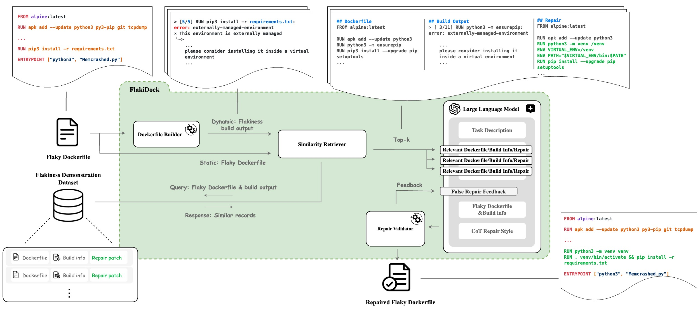

# Dockerfile Flakiness Study

# An overview of the project architecture



# Instructions

## 1. Environment setup

Create conda environment with the following command:

```bash
conda create --name docker-study python=3.9.18
```

### Activate environment

```bash
conda activate docker-study
```

### Install dependencies

```bash
pip install -r requirements.txt
```

### Dependency changes

In case new dependencies are installed in the environment:

```bash
pip freeze > requirements.txt
```

## 2. Docker setup

### MacOS

(open /Applications/Docker.app)

### Linux

```bash
service docker start
```

Or

```bash
systemctl start docker
```

## 3. .env setup

create a `.env` file and add the following:

```.env
PYTHONPATH=./:./error-analysis
OPENAI_API_KEY=<YOUR-OPENAI-API-KEY>
GOOGLE_API_KEY=<YOUR-GOOGLE-API-KEY>
```

`PYTHONPATH` defined the known paths for packaging **(vscode)**. Similarly, you can mark `error-analysis` as the <u>Source Root</u> **(Intellij)**.

If you're using terminal directly, make sure `PYTHONPATH` is added to your environment:

```bash
export PYTHONPATH=./:./error-analysis
```

## 4. AWS Generative Models (Bedrock & Sagemaker) setup

It is handy to install `awscli`:

`brew install awscli`

Create a new profile in `~/.aws/credentials`:

```bash
❯ cat ~/.aws/credentials
[default]
aws_access_key_id = YOUR_ACCESS_KEY
aws_secret_access_key = YOUR_SECRET_KEY
```

Create a config file in `~/.aws/config`

```bash
❯ cat ~/.aws/config
[default]
region = us-west-2
```

**Please do not push your AWS access key and secret to GitHub.**

# Empirical Analysis Setup (optional)

## Data Collection

Read [data-collection](data-collection/README.md) for further information.

## Dockerfile Build

Read [dockerfile-build](docker-utils/README.md) for further information.

# Dataset

Read [dataset-info](dataset/README.md) for further information!

# Flakiness Analysis
Includes:

- Flakiness Categorization
- Flakiness Repair Generation: FlakiDock

Read [error-analysis](error-analysis/README.md) for further information.
